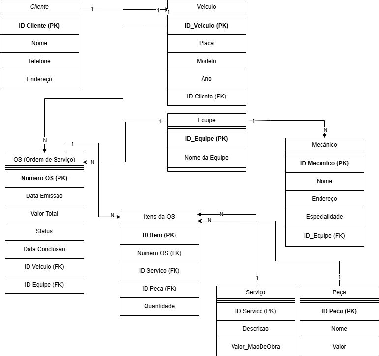

# Modelo Conceitual - Oficina Mecânica

## Descrição
Este projeto apresenta o modelo conceitual de banco de dados para um sistema de controle de ordens de serviço em uma oficina mecânica. Ele foi desenvolvido com base em uma narrativa fornecida e inclui todas as entidades, atributos e relacionamentos necessários.

## Entidades Principais
- **Cliente**: Representa os clientes que utilizam os serviços da oficina.
- **Veículo**: Representa os veículos pertencentes aos clientes.
- **Equipe**: Representa os grupos de mecânicos.
- **Mecânico**: Representa os profissionais responsáveis pelos serviços.
- **OS (Ordem de Serviço)**: Representa o documento que organiza os serviços realizados.
- **Serviço**: Representa os tipos de serviços disponíveis.
- **Peça**: Representa as peças utilizadas nos serviços.
- **Itens da OS**: Representa a relação entre serviços, peças e a OS.

## Esquema Conceitual

